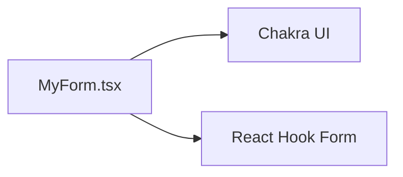

# useform-sample

このプロジェクトは、Chakra UIとReact Hook Formを使用して作成されたフォームのサンプルです。

## ファイル構成

```
└──useform-sample
    ├──README.md
    ├──package-lock.json
    ├──package.json
    ├──public
    │   ├──favicon.ico
    │   ├──index.html
    │   ├──logo192.png
    │   ├──logo512.png
    │   ├──manifest.json
    │   └──robots.txt
    └──src
        ├──App.css
        ├──App.tsx
        ├──MyForm.tsx
        ├──index.css
        └──index.tsx
```

## 構成図



## MyForm.tsx

### 概要

フォームを表示するコンポーネントです。

### コードの解説

- UseFormInputs：フォームの項目を定義するインターフェースです。
- MyForm：フォームを表示するコンポーネントの関数です。
- useForm：フォームのバリデーション、エラーメッセージ表示、送信のためのReact Hookです。
- handleSubmit：フォームの送信時に呼び出される関数です。
- reset：フォームのリセットを行う関数です。
- errors：フォームのバリデーションエラーが格納されるオブジェクトです。
- register：フォーム要素とReact Hook Formを関連付けるためのPropsです。

### インストール

```sh
npm install
```